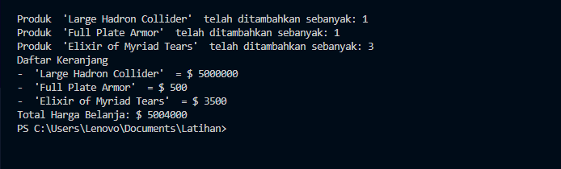

# Praktikum-5-OOP
## Nama : Yusdiansyah Andika Haryo Saputra
## Kelas: TI.23.A.6
## NIM  : 312310650
&nbsp;
&nbsp;
## Class Produk
```java
public class produk {
    protected String namaProduk;
    protected int harga;
    protected int jumlahStok;

    public produk(String namaProduk, int harga, int jumlahStok){
        this.namaProduk = namaProduk;
        this.harga = harga;
        this.jumlahStok = jumlahStok;
    }

    public  String getnamaProduk(){
        return namaProduk;
    }
    public int getharga(){
        return harga;
    }
    public int getjumlahStok(){
        return jumlahStok;
    }
    public void stokberkurang(int jumlah){
        this.jumlahStok -= jumlah;
    }

    public void displayinfo(){
        System.out.println("Nama Produk: " + namaProduk);
        System.out.println("Harga Produk: " + harga);
        System.out.println("Stok Tersisa: " + jumlahStok);
    }
}
```
&nbsp;
## Class Elektronik
```java
public class elektronik extends produk {
    int garansi;

    public elektronik(String namaProduk, int harga, int jumlahStok) {
        super(namaProduk, harga, jumlahStok);
        this.garansi = garansi;
    }

    public void setgaransi(int garansi){
        this.garansi = garansi;
    }
    public int getgaransi(){
        return garansi;
    }

    @Override
    public void displayinfo(){
        super.displayinfo();
        System.out.println("Garansi: " + this.garansi + "Tahun");
    }
}
```
&nbsp;
## Class Pakaian
```java
public class pakaian extends produk{
    
    private String warna;
    private int ukuran;
    public pakaian(String namaProduk, int harga, int jumlahStok) {
        super(namaProduk, harga, jumlahStok);
        this.warna = warna;
        this.ukuran = ukuran;
    }

    public String getwarna(){
        return warna;
    }
    public int getukuran(){
        return ukuran;
    }
    public void displayinfo(){
        super.displayinfo();
        System.out.println("Warna: "+ this.warna);
        System.out.println("ukuran: "+ this.ukuran);
    }
}
```
&nbsp;
## Class Makanan
```java
import java.util.Date;

public class makanan extends produk {
    
    private Date exp;

    public makanan(String namaProduk, int harga, int jumlahStok) {
        super(namaProduk, harga, jumlahStok);
        this.exp = exp;
    }
    
    @Override
    public void displayinfo(){
        super.displayinfo();
        System.out.println("EXP: "+ this.exp);
    }
}
```
&nbsp;
## Class keranjang belanja
```java
import java.util.ArrayList;
public class keranjangbelanja {
    
    private ArrayList<produk> keranjang;
    
    public keranjangbelanja(){
        keranjang = new ArrayList<>();
    }
    public void tambahproduk(produk p, int jumlah){
        if (p.getjumlahStok() >= jumlah){
            p.stokberkurang(jumlah);
            keranjang.add(p);
            System.out.println("Produk "+p.getnamaProduk() + " telah ditambahkan sebanyak: "+jumlah);
        } else {
            System.out.println("Stok dari produk "+ p.getnamaProduk()+" tidak mencukupi");
        }
    }
    public int hitungtotalbelanja(){
        int total = 0;
        for (produk item : keranjang){
            total += item.getharga();
        }
        return total;
    }
    public void displaykeranjang(){
        System.out.println("Daftar Keranjang");
        for (produk item : keranjang){
            System.out.println("- "+ item.getnamaProduk()+" = $ "+ item.getharga());
        } System.out.println("Total Harga Belanja: $ " + hitungtotalbelanja());
    }
}
```
&nbsp;
## Class Main
```java

public class main {
    public static void main(String[] args) {
        elektronik device = new elektronik(" 'Large Hadron Collider' ", 5000000, 1);
        pakaian sandang = new pakaian(" 'Full Plate Armor' ", 500, 30);
        makanan pangan = new makanan(" 'Elixir of Myriad Tears' ", 3500, 5);

        keranjangbelanja keranjang = new keranjangbelanja();

        keranjang.tambahproduk(device, 1);
        keranjang.tambahproduk(sandang, 1);
        keranjang.tambahproduk(pangan, 3);

        keranjang.displaykeranjang();
    }    

}
```

